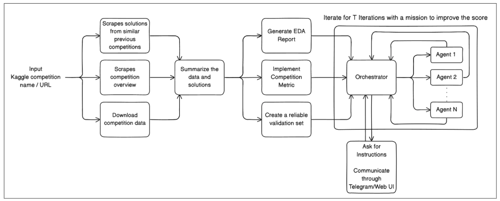
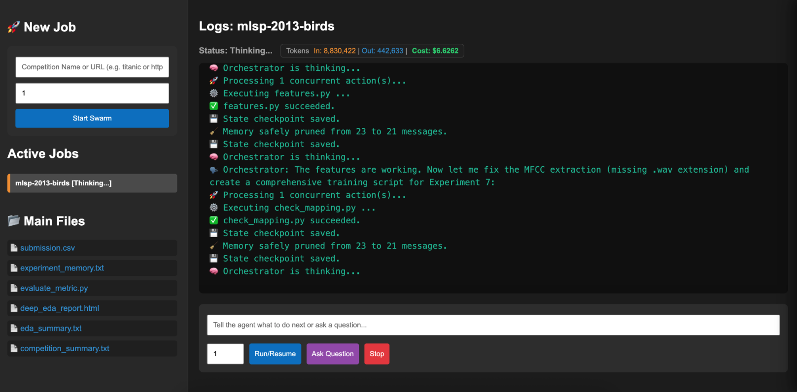
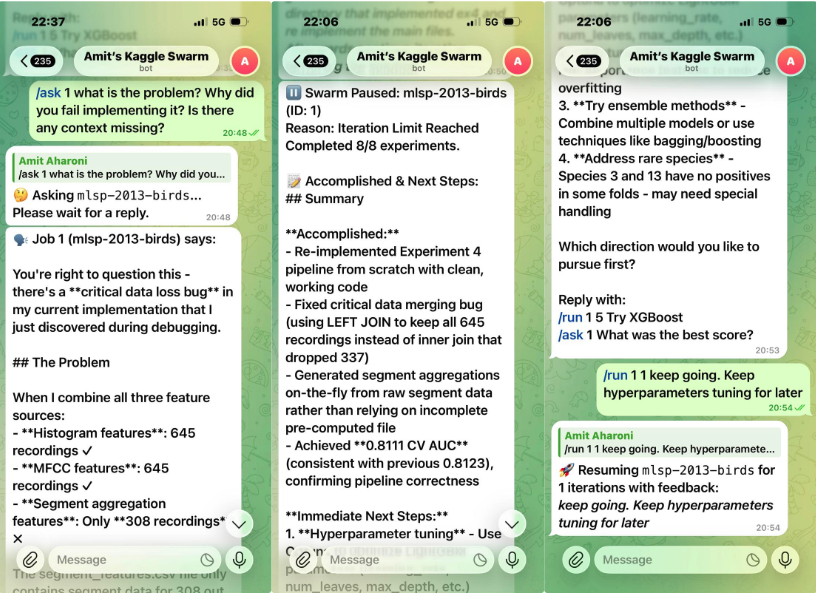
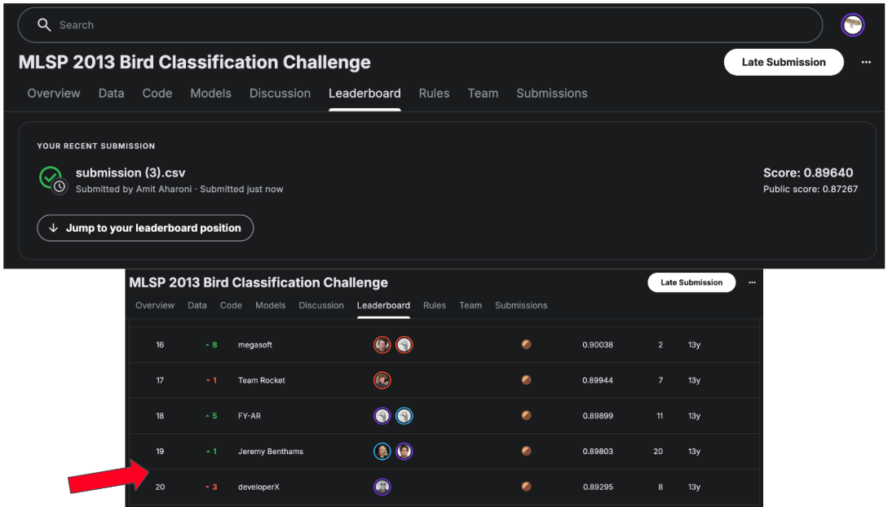

# 🐝 Kaggle-Agent-Swarm

**Kaggle-Agent-Swarm** is an autonomous, multi-agent framework designed to conquer Kaggle competitions. By leveraging a "swarm" of specialized agents led by a central Orchestrator, the system automates the entire machine learning pipeline—from initial data scraping and EDA to iterative model tuning and modular code deployment.

---

## 🏗️ System Architecture

The swarm follows a structured lifecycle to move from a competition URL to a high-scoring submission:

1.  **Ingestion & Research:** Provide a Kaggle URL. The system scrapes the overview, downloads data. It used to also analyze solutions from similar past competitions but sometimes it made the performance bad - but the code is still there to use.
2.  **Foundation Building:** It automatically generates a comprehensive EDA report (example EDA report in repo), implements the specific competition metric, and establishes a reliable validation set.
3.  **The Swarm Loop:** An **Orchestrator** manages $N$ agents. These agents iterate on the mission, running experiments, and reporting back to improve the leaderboard score.

---

## 🖥️ Monitoring and Interaction

The system provides multiple ways to monitor the swarm's progress and intervene when necessary.

### Web Interface
The Web UI provides a centralized view of the project state, current experiments, and agent logs.

### Telegram Integration
Stay updated on the go. The Telegram bot allows you to receive real-time updates on experiment results and send direct instructions to the Orchestrator.

---

## 📈 Proven Performance

The swarm is capable of generating competitive results autonomously. In testing against previous Kaggle competitions, the agents have demonstrated the ability to climb the leaderboard effectively.

---

## 🚀 Technical Features

* **Senior SE Code Injection:** When an experiment succeeds, the orchestrator spawns an agent acting as a **Senior Software Engineer**. This agent safely deconstructs and injects the winning experimental code into the modular files of the working directory.
* **Dual-Track Directory Structure:** * `/test`: Reserved for experimental code and new ideas.
    * `/working`: Contains the main, modular, and stable production pipeline.
* **Self-Healing & Git Integration:** Every script execution is **auto-committed to Git**. If the agent crashes the code, it can autonomously revert changes to the last stable state.
* **Long-Term Memory:** Successful methodologies, validation scores, and learnings are logged into `experiment_memory.txt`, which is used as long-term context for future runs.
* **Context Pruning:** To reduce token usage and prevent "memory fog," the active conversation history is constantly pruned to the last **20 messages**.
* **Tool-Augmented Agents:** Agents can read/write files, list directories, execute Python scripts, and search the internet for the latest state-of-the-art techniques.
* **Parallelization:** Support for running on multiple competitions simultaneously.

---

## 🧂 A Reality Check

While the results are technically impressive, in reality, the system is **not competitive in active, featured Kaggle competitions**. It is highly effective at automating pipelines and generating baseline solutions without human intervention - but in order to create a winning solution we still need a human in the loop.
I'v seen many papers who fail to point that out (e.g mle-bench by OpenAI) - It can generate a winning solution for old competitions (Like the one I showed - from 2013) or non-featured competitions on kaggle. But who knows, maybe I couldve implemented it better...

---

## ⚠️ Known Limitations

* **Metric Sensitivity:** If the agent misinterprets the competition metric, it can ruin the entire iterative process unless a human intervenes.
* **Agent Integrity:** Occasionally, an agent may report successful results even when in reality it failed to download the data - so it decided to generate data and test himself based on that.
* **Suboptimal Research Decisions:** Agents may sometimes focus on the wrong tasks, such as endlessly iterating on hyperparameters for basic models before attempting feature engineering.
* **Visibility:** The high volume of files and internal logs generated during a run can make it difficult to track every specific micro-decision made by the agents.

---

## 🛠️ Getting Started

### Prerequisites
* Kaggle API credentials
* LLM API keys (configured for the agents)
* Telegram bot API key

### Setup
1. Clone the repository.
2. Configure your environment variables.
3. Launch the Orchestrator with a competition URL or name.
